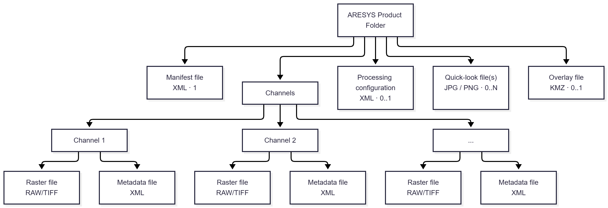

# Product Folder { #pf data-toc-label="Product Folder" }

With the term **Product Folder** we refer to the official Aresys product format for SAR sensor data and auxiliary data
storage and distribution.

This is a proprietary format used to organize and store SAR products. It defines a common structure for representing
product data, metadata, and additional information, regardless of the specific type of product.

The format provides a consistent organization for SAR data and its associated metadata, making products easier to access,
interpret, and manage. At its core, an ARESYS product is structured as a folder containing one or more channels, with each
channel represented by its associated data and metadata files.

The ARESYS Product Format provides a common structure for the different products generated throughout the ARESYS SAR
processing chain. Regardless of whether a product contains raw SAR data, processed imagery, or interferometric results,
the same general principles apply: the product is organized as a folder, data is divided into one or more channels, and
each channel is associated with its data and metadata.

This common organization provides the foundation for consistently accessing and managing ARESYS products across the
different processing tools and applications.

Managing and working with this format can be done directly through `aresys_io.product`, without having to navigate
through its individual submodules. Common operations include:

- opening and navigating Product Folders
- reading point-target products and raster files
- creating and updating metadata and handling the different components

Here is a high-level overview of the product structure, while all details are available in the
[Product Folder specification document](TBD).

## Product Types

The main product types supported by this format can be grouped into three categories:

- **Level 0 (RAW) products** contain the SAR data as acquired by the SAR instrument or simply simulated.
- **Level 1 products** contain SAR data resulting from Level 1 processing.
- **Interferometric products** contain the results of interferometric SAR processing, such as coregistered images,
 interferograms, and coherence maps.

Despite their different contents and processing levels, all these products follow the same general product structure.

## Product Structure

<figure markdown="span">

{ width="900" }

<figcaption>Product Folder layout.</figcaption>

</figure>

An ARESYS product is physically represented as a **folder** containing the files required to describe and store the product.

A product is composed of one or more **channels**. Channels are used to represent different data dimensions within a product,
such as multiple swaths or polarizations. For example, a product containing data from multiple swaths or polarization
combinations will typically contain one channel for each swath/polarization combination.

The main content of a product folder consists of a set of **binary files and annotation files**, with one pair associated
with each channel. Additional files may be present to provide information about the product, its processing configuration,
or derived visualizations.

At a high level, an ARESYS product can therefore be viewed as a collection of:

- a product-level description
- one or more channels containing the actual SAR data
- metadata associated with each channel
- optional information describing how the product was generated
- optional quick-look and visualization files

## Product Folder at a Glance

From a structural point of view, an ARESYS product can be summarized as a folder containing a set of mandatory and
optional components:

```text
Product Folder/
├── Manifest.xml                 # Optional product description
├── Binary file(s)               # SAR data, one per channel
├── Annotation file(s)           # Metadata, one per channel
├── Processing configuration     # Optional processing parameters
├── Quick-look file(s)           # Optional data previews
└── Overlay.kmz                  # Optional geographical overlay
```

The exact number of files depends on the product type and the number of channels it contains. Binary and annotation files
are the core components of the product, while the remaining files provide additional descriptive, processing, or
visualization information.

## Product Components

### Manifest

The **manifest file** provides a brief, optional description of the product and its channels. It is stored as an XML file
and there is at most one manifest for each product.

### Binary Data

The **binary files** contain the actual SAR data associated with the product. Each binary file corresponds to a channel.

Depending on the product, the data can be stored in TIFF or other binary formats. Products containing multiple swaths or
polarization combinations use multiple binary files, with each file representing a specific channel.

### Annotation

Each binary file is associated with an **annotation file**. Annotation files contain the main metadata required to
describe and interpret the corresponding SAR data.

This metadata can include information such as timing, orbit and attitude data, Doppler centroid estimates, and other
parameters describing the product.

Annotation files are stored in XML format and have a one-to-one correspondence with the binary files.

### Processing Configuration

A product may optionally include a **processing configuration file**. This XML file contains the processing parameters
used to generate the product.

Processing configuration files are not available for Level 0 products.

### Quick Look

**Quick-look files** provide a visual representation of the SAR data and can be used to quickly inspect the content of a
product without directly accessing the binary data.

Quick looks are optional and have a one-to-one correspondence with the binary files. They can be generated by other tools
and stored in JPG or PNG format.

### Overlay

An optional **overlay file** can provide a geographical representation of the product for visualization in applications
such as `Google Earth`.

The overlay is stored as a KMZ file.

## Channels

Channels are a fundamental concept of the ARESYS Product Format. A product can contain a single channel or multiple
channels, depending on the type of SAR data it represents.

Multiple channels are primarily used to represent **multi-swath** and **multi-polarization** products. In these cases,
each channel identifies a specific combination of swath and polarization, and its associated binary and annotation files
contain the corresponding data and metadata.

This channel-based organization allows different data components to be kept together within a single product while
maintaining a clear separation between their associated data and metadata.
